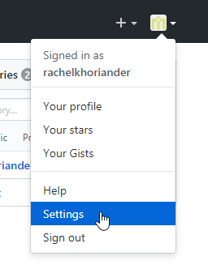
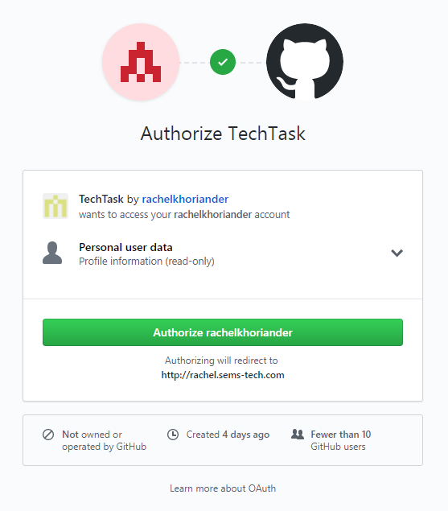

# Authenticating with GitHub

Welcome to the first of a series of tutorials on using the GitHub API. In this tutorial, you will learn how to use GitHub's API to authenticate users to your own website, as demonstrated through a simple PHP application. 

Benefits of using GitHub to authenticate include:

- less development time
-	less code to implement
- reduced maintenance

Using simple PHP, we can focus in on the integration process without complicating the issue by introducing unfamiliar frameworks. Using PHP also allows us to avoid exposing sensitive data through client-side code. 

Throughout this tutorial, we have kept the code simple, so you will need to create your own error handling.

## Topics

- [How Does GitHub Authentication Work?](#how-does-github-authentication-work)  
  - [What is an Access Token?](#what-is-an-access-token)  
- [Registering the Application with GitHub](#registering-the-application-with-github)  
- [Building the Application](#building-the-application)  
    - [Accessing the GitHub API (init.php)](#accessing-the-github-api)  
    - [Building the Index Page (index.php)](#building-the-index-page)  
    - [Processing the Login (login.php)](#processing-the-login)  
    - [Processing the Callback (callback.php)](#processing-the-callback)  
    - [Building the Main Page (main.php)](#building-the-main-page)  
    - [Processing the Logout (logout.php)](#processing-the-logout)  
- [Deploying the Application](#deploying-the-application)  
- [Running the Application](#running-the-application)

## How Does GitHub Authentication Work?

Like many other sites, GitHub uses a security framework called OAuth to allow users to grant third-party applications access to their GitHub data without giving them the password. To accomplish this, GitHub’s authorization server issues access tokens to third-party clients. When a user logs on to the system and provides credentials that authenticate against the authentication database, the logon service generates the access token, which is then used by the third party to access protected resources hosted by GitHub.

The basic process is as follows:

1. The third-party client initiates and redirects the user to GitHub.
2. The user authenticates.
3. GitHub redirects the user to the client, providing an authorization code.
4. The client exchanges the code for an access token.
5. The client accesses the API using the user’s access token.

### What is an Access Token?

An access token is a piece of data that accompanies a request to a server and is verified for authenticity before the server responds to the request. The third-party application provides a key, or _secret_, along with the token to allow the server to decode and verify it. Without the correct secret, the token is useless.

## Registering the Application with GitHub

Before you can use GitHub authentication for your web application, you must first register it with GitHub. You can register your app under your personal account or under any organization to which you have administrative access.

Before you begin, you will need to know:

-	Your application’s main URL
-	Your callback URL (the URL of the page to which GitHub should redirect the user after authentication is complete)

Once you have gathered this info, you are ready to register.

1. Log in to your GitHub account.
2. In the upper-right corner, click your profile photo, then click **Settings**.

    
    
3. In the left sidebar, click **Developer settings**.

    

4. Click **Register a new application**.

    

5. Type in the details for your application, and click **Register application**.

    

    Field                        | Description
    -----------------------------|-------------------------------
    `Application name`           | **Required.** The name of your application.
    `Homepage URL`               | **Required.** The full URL to your app's website. For security purposes, you should use https.
    `Application description`    | A description of your app that will be shared with users.
    `Authorization callback URL` | **Required.** The callback URL for your app. This is where GitHub will redirect users after they successfully log in. It must be on the same domain as your main URL and must be a valid URL; GitHub won't accept _localhost_.

When you have finished, GitHub will assign your application a **Client ID** and **Client Secret**. 


> **Note:**  
> Notice that you can edit options for your app, track user metrics, and revoke user tokens from this page. This will come in handy during testing.

## Building the Application

Now that GitHub has assigned our application a Client ID and Client Secret, we can build our application. The app will contain the following assets:

- **Main logic script** (include file - init.php)  
    Acts as the brains of the operation: makes the initial call to the GitHub API, uses the returned code to get an access token, and fetches user data.
- **Index page** (index.php)  
    Serves as the initial page of the app. Contains log in button.
- **Login script** (login.php)  
    Handles the login process.
-	**Callback script** (callback.php)  
    Handles callback logic and redirects the user appropriately.
-	**Main page** (main.php)  
    Serves as the main page of the app once the user logs in. Contains log out button.
-	**Logout script** (logout.php)  
    Handles the logout process.
-	**Stylesheet** (style.css)  
    Unnecessary, but included in the repo to make the app look a little prettier.

### Accessing the GitHub API


### Building the Index Page

The user will arrive on the application's index page, which includes the **Sign In with GitHub** button.

```php
<?php
session_start();

require "init.php";

//If session is not empty, redirect to callback page.
if (isset($_SESSION['user'])) {
     header("location: callback.php");
}
?>

<!DOCTYPE html>
<html lang="en">
  <head>
    <meta charset="UTF-8">
    <title>Technical Task: Sign In with GitHub</title>
    <link href="style.css" rel="stylesheet">
  </head>
  <body>
    <div class="content">
      <p>Hello, world.</p>
      <p><a href="login.php"><input type='submit' name='submit' value='Sign In with GitHub' /></a></p>
    </div>
  </body>
</html>
```

### Processing the Login

Once the user clicks **Sign In with GitHub**, we will redirect the user to the GitHub API.

```php
<?php

require "init.php";

//Redirect user to GitHub authentication page
goToAuthUrl();

//If redirect fails, then:
echo "Operation failed.";
```

### Processing the Callback

When redirected from the GitHub API, we will fetch the user data and redirect to the main application page. 

```php
<?php
 
session_start();
 
require "init.php";

//Use code to get access token, then fetch user data from GitHub.
fetchData();

//If session is empty, redirect to index page, so user can log in.
if (!isset($_SESSION['user'])) {
     header("location: index.php");
}
//Else redirect to main page.
else {
     header("location: main.php");
}
```

### Building the Main Page

If the login is successful, we will display the main page with the **Sign Out with GitHub** button.

```php
<?php

session_start();

require "init.php";

//If session is empty, redirect to index page, so user can log in.
if (!isset($_SESSION['user'])){
    header("location: index.php");
}
?>

<!DOCTYPE html>
<html lang="en">
  <head>
    <meta charset="UTF-8">
    <title>Technical Task: Sign Out with GitHub</title>
    <link href="style.css" rel="stylesheet">
  </head>
  <body>
    <div class="content">
      <p>Hello, <?php echo $_SESSION['user'] ?>.</p>
      <p>Your public email address is:<br/>
      <?php echo $_SESSION['email'] ?>.</p>
      <p><a href="logout.php"><input type='submit' name='submit' value='Sign Out with GitHub' /></a></p>
    </div>   
  </body>
</html
```

### Processing the Logout

Once the user clicks **Sign Out with GitHub**, we will destroy the session and redirect the user to the index page.

```php
<?php

session_start();

//Clear and destroy session.
unset($_SESSION['user']);
session_destroy();

//Redirect to index page, so user can log in.
header("location: index.php");
```

## Deploying the Application


## Running the Application

Now that everything is properly configured, let’s run our application to review what users will see.

1.	Type the URL to the appication's index page (index.php), and click **Sign In with GitHub**.  

    
 
2.	Log in using GitHub’s API.  

    

3.	Authorize access to your GitHub user data.  

    
 
    > Note:  
    > Notice the access level corresponds to the requsted scope.

4.	Arrive at the application’s main page (main.php).  

    
 
## Next Steps
To learn more about GitHub's API, visit the [GitHub Developer Guide](https://developer.github.com/apps/getting-started-with-building-apps/).

To learn more about extracting data from the GitHub API, stay tuned for a forthcoming tutorial.

