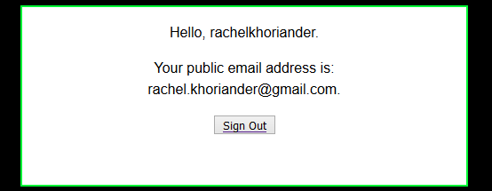

# Authenticating with GitHub

Welcome to the first of a series of tutorials on using the GitHub API. In this tutorial, you will learn how to use GitHub's API to authenticate users to your own website, as demonstrated through a simple PHP application. 

Benefits of using GitHub to authenticate include:

- less development time
-	less code to implement
- reduced maintenance

Using simple PHP, we can focus in on the integration process without complicating the issue by introducing unfamiliar frameworks. Using PHP also allows us to avoid exposing sensitive data through client-side code. 

Throughout this tutorial, we have kept the code simple, so you will need to create your own error handling.

## Topics

- [How Does GitHub Authentication Work?](#how-does-github-authentication-work)  
  - [What is an Access Token?](#what-is-an-access-token)  
- [Registering the Application with GitHub](#registering-the-application-with-github)  
- [Building the Application](#building-the-application)  
    - [Accessing the GitHub API (access_gh.php)](#accessing-the-github-api)  
    - [Building the Index Page (index.php)](#building-the-index-page)  
    - [Processing the Login (login.php)](#processing-the-login)  
    - [Processing the Callback (callback.php)](#processing-the-callback)  
    - [Building the Main Page (main.php)](#building-the-main-page)  
    - [Processing the Logout (logout.php)](#processing-the-logout)  
- [Deploying the Application](#deploying-the-application)  
- [Running the Application](#running-the-application)

## How Does GitHub Authentication Work?

Like many other sites, GitHub uses a security framework called OAuth to allow users to grant third-party applications access to their GitHub data without giving them the password. To accomplish this, GitHub’s authorization server issues access tokens to third-party clients. When a user logs on to the system and provides credentials that authenticate against the authentication database, the logon service generates the access token, which is then used by the third party to access protected resources hosted by GitHub.

The basic process is as follows:

1. The third-party client initiates and redirects the user to GitHub.
2. The user authenticates.
3. GitHub redirects the user to the client, providing an authorization code.
4. The client exchanges the code for an access token.
5. The client accesses the API using the user’s access token.

### What is an Access Token?

An access token is a piece of data that accompanies a request to a server and is verified for authenticity before the server responds to the request. The third-party application provides a key, or _secret_, along with the token to allow the server to decode and verify it. Without the correct secret, the token is useless.

## Registering the Application with GitHub

Before you can use GitHub authentication for your web application, you must first register it with GitHub. You can register your app under your personal account or under any organization to which you have administrative access.

Before you begin, you will need to know:

-	Your application’s main URL
-	Your callback URL (the URL of the page to which GitHub should redirect the user after authentication is complete)

Once you have gathered this info, you are ready to register.

1. Log in to your GitHub account.
2. In the upper-right corner, click your profile photo, then click **Settings**.

    
    
3. In the left sidebar, click **Developer settings**.

    

4. Click **Register a new application**.

    

5. Type in the details for your application, and click **Register application**.

    

    Field                        | Description
    -----------------------------|-------------------------------
    `Application name`           | **Required.** The name of your application.
    `Homepage URL`               | **Required.** The full URL to your app's website. For security purposes, you should use https.
    `Application description`    | A description of your app that will be shared with users.
    `Authorization callback URL` | **Required.** The callback URL for your app. This is where GitHub will redirect users after they successfully log in. It must be on the same domain as your main URL and must be a valid URL; GitHub won't accept _localhost_.

When you have finished, GitHub will assign your application a **Client ID** and **Client Secret**. 


> **Note:**  
> Notice that you can edit options for your app, track user metrics, and revoke user tokens from this page. This will come in handy during testing.

## Building the Application

Now that GitHub has assigned our application a Client ID and Client Secret, we can build our application. The app will contain the following assets:

- **Main logic script** (include file - access_gh.php)  
    Acts as the brains of the operation: makes the initial call to the GitHub API, uses the returned code to get an access token, and fetches user data.
- **Index page** (index.php)  
    Serves as the initial page of the app. Contains log in button.
- **Login script** (login.php)  
    Handles the login process.
-	**Callback script** (callback.php)  
    Handles callback logic and redirects the user appropriately.
-	**Main page** (main.php)  
    Serves as the main page of the app once the user logs in. Contains log out button.
-	**Logout script** (logout.php)  
    Handles the logout process.
-	**Stylesheet** (style.css)  
    Unnecessary, but included in the repo to make the app look a little prettier.

### Accessing the GitHub API

In this tutorial, the code required to interact with the GitHub API is located in an include file (access_gh.php).

#### Authenticating Users
When you are ready to authenticate users, you'll need to send a GET request to GitHub to request an access code for your application.

```php
https://github.com/login/oauth/authorize?client_id=_CLIENT_ID_&redirect_url=_REDIRECT_URL_&scope=_SCOPE_&state=_STATE_
```

##### Parameters
You can (and should) append these parameters to the URL.
Name	Type	Description
client_id	string	Required. The client ID that GitHub assigned to your application when you registered.

redirect_uri	string	The URL in your application where users will be sent after authorization. If this is not provided, GitHub will redirect users to the Callback URL you provided when you registered your application. If provided, the redirect URL's host and port must exactly match the callback URL. The redirect URL's path must reference a subdirectory of the callback URL.
scope	string	Scopes are named groups of permissions that an OAuth App can request to access both public and non-public data. The scope attribute lists scopes attached to the token that were granted by the user.
A space-delimited list of scopes. If not provided, scope defaults to an empty list for users that have not authorized any scopes for the application. For users who have authorized scopes for the application, the user won't be shown the OAuth authorization page with the list of scopes. Instead, this step of the flow will automatically complete with the set of scopes the user has authorized for the application. For example, if a user has already performed the web flow twice and has authorized one token with user scope and another token with repo scope, a third web flow that does not provide a scope will receive a token with user and repo scope.
state	string	An unguessable random string used to protect against cross-site request forgery attacks.
allow_signup	string	Whether or not unauthenticated users will be offered an option to sign up for GitHub during the OAuth flow. The default is true.

About Scopes
Your app can have read or write access to specific types of users’ GitHub data. 
•	Read access allows your app to look at data.
•	Write access allows your app to change data.
When users authenticate, GitHub lets them know what type of data your applications wants to access and what type of access to that data your application is requesting. 
NOTE: Normally, users will grant you scopes identical to what you requested, but remember that they can always choose to refuse or modify the type of access allowed; make sure you handle errors accordingly.
Types of Data
Type of data	Description
Commit status	You can grant access for an app to report your commit status. Commit status access allows apps to determine if a build is a successful against a specific commit. Apps won't have access to your code, but they can read and write status information against a specific commit.
Deployments	Deployment status access allows apps to determine if a deployment is successful against a specific commit for public and private repositories. Apps won't have access to your code.
Gists	Gist access allows apps to read or write to both your public and secret Gists.

Hooks	Webhooks access allows apps to read or write hook configurations on repositories you manage.
Notifications	Notification access allows apps to read your GitHub notifications, such as comments on issues and pull requests. However, apps remain unable to access anything in your repositories.
Organizations and teams	Organization and teams access allows apps to access and manage organization and team membership.
Personal user data	User data includes information found in your user profile, like your name, e-mail address, and location.
Repositories	Repository information includes the names of contributors, the branches you've created, and the actual files within your repository. Apps can request access for either public or private repositories on a user-wide level.
Repository delete	Apps can request to delete repositories that you administer, but they won't have access to your code.


Scopes
Name	Description
(no scope)	Grants read-only access to public information (includes public user profile info, public repository info, and gists)
Repo	Grants read/write access to code, commit statuses, invitations, collaborators, adding team memberships, and deployment statuses for public and private repositories and organizations.
 repo:status	Grants read/write access to public and private repository commit statuses. This scope is only necessary to grant other users or services access to private repository commit statuses without granting access to the code.
 repo_deployment	Grants access to deployment statuses for public and private repositories. This scope is only necessary to grant other users or services access to deployment statuses, without granting access to the code.
 public_repo	Grants read/write access to code, commit statuses, collaborators, and deployment statuses for public repositories and organizations. Also required for starring public repositories.
 repo:invite	Grants accept/decline abilities for invitations to collaborate on a repository. This scope is only necessary to grant other users or services access to invites without granting access to the code.
admin:org	Fully manage organization, teams, and memberships.
 write:org	Publicize and unpublicize organization membership.
 read:org	Read-only access to organization, teams, and membership.
admin:public_key	Fully manage public keys.
 write:public_key	Create, list, and view details for public keys.
 read:public_key	List and view details for public keys.
admin:repo_hook	Grants read, write, ping, and delete access to hooks in public or private repositories.
 write:repo_hook	Grants read, write, and ping access to hooks in public or private repositories.
 read:repo_hook	Grants read and ping access to hooks in public or private repositories.
admin:org_hook	Grants read, write, ping, and delete access to organization hooks. Note:OAuth tokens will only be able to perform these actions on organization hooks which were created by the OAuth App. Personal access tokens will only be able to perform these actions on organization hooks created by a user.
Gist	Grants write access to gists.
Notifications	Grants read access to a user's notifications. repo also provides this access.
User	Grants read/write access to profile info only. Note that this scope includes user:email and user:follow.
 read:user	Grants access to read a user's profile data.
 user:email	Grants read access to a user's email addresses.
 user:follow	Grants access to follow or unfollow other users.
delete_repo	Grants access to delete adminable repositories.
admin:gpg_key	Fully manage GPG keys.
 write:gpg_key	Create, list, and view details for GPG keys.
 read:gpg_key	List and view details for GPG keys.

For more info, see About scopes for OAuth Apps in the GitHub Developer documentation.

A Word about State


##### Review the Code
In the code snippet below, the `client_id` is pulled from your application’s GitHub registration page, and the `redirect_uri` is identical to the `Authorization callback URL` you entered when registering your application with GitHub (see [Registering the Application with GitHub](#registering-the-application-with-github)). If no `redirect_uri` is provided in the code, GitHub automatically redirects the user to the `Authorization callback URL`.

```php
function goToAuthURL() {
    $client_id= "02786875d196f38bfdf1";
    $redirect_url= "https://rachel.sems-tech.com/callback.php";
 
    if ($_SERVER['REQUEST_METHOD'] == 'GET') {
        $url = 'https://github.com/login/oauth/authorize?client_id='. $client_id. '&redirect_url='. $redirect_url.'&scope=read:user';
        header("location: $url");
    }
}
```


### Building the Index Page

The user will arrive on the application's index page, which includes the **Sign In with GitHub** button.

```php
<?php
session_start();

//If session is not empty, redirect to callback page.
if (isset($_SESSION['user'])) {
     header("location: callback.php");
}
?>

<!DOCTYPE html>
<html lang="en">
  <head>
    <meta charset="UTF-8">
    <title>Technical Task: Sign In with GitHub</title>
    <link href="style.css" rel="stylesheet">
  </head>
  <body>
    <div class="content">
      <p>Hello, world.</p>
      <p><a href="login.php"><input type='submit' name='submit' value='Sign In with GitHub' /></a></p>
    </div>
  </body>
</html>
```

### Processing the Login

Once the user clicks **Sign In with GitHub**, we will redirect the user to the GitHub API.

```php
<?php

require "access_gh.php";

//Redirect user to GitHub authentication page
goToAuthUrl();

//If redirect fails, then:
echo "Operation failed.";
```

### Processing the Callback

When redirected from the GitHub API, we will fetch the user data and redirect to the main application page. 

```php
<?php
 
session_start();
 
require "access_gh.php";

//Use code to get access token, then fetch user data from GitHub.
fetchData();

//If session is empty, redirect to index page, so user can log in.
if (!isset($_SESSION['user'])) {
     header("location: index.php");
}
//Else redirect to main page.
else {
     header("location: main.php");
}
```

### Building the Main Page

If the login is successful, we will display the main page with the **Sign Out with GitHub** button.

```php
<?php

session_start();

//If session is empty, redirect to index page, so user can log in.
if (!isset($_SESSION['user'])){
    header("location: index.php");
}
?>

<!DOCTYPE html>
<html lang="en">
  <head>
    <meta charset="UTF-8">
    <title>Technical Task: Sign Out with GitHub</title>
    <link href="style.css" rel="stylesheet">
  </head>
  <body>
    <div class="content">
      <p>Hello, <?php echo $_SESSION['user'] ?>.</p>
      <p>Your public email address is:<br/>
      <?php echo $_SESSION['email'] ?>.</p>
      <p><a href="logout.php"><input type='submit' name='submit' value='Sign Out with GitHub' /></a></p>
    </div>   
  </body>
</html
```

### Processing the Logout

Once the user clicks **Sign Out with GitHub**, we will destroy the session and redirect the user to the index page.

```php
<?php

session_start();

//Clear and destroy session.
unset($_SESSION['user']);
session_destroy();

//Redirect to index page, so user can log in.
header("location: index.php");
```

## Deploying the Application


## Running the Application

Now that everything is properly configured, let’s run our application to review what users will see.

1.	Type the URL to the appication's index page (index.php), and click **Sign In with GitHub**.  

    
 
2.	Log in using GitHub’s API.  

    

3.	Authorize access to your GitHub user data.  

    
 
    > Note:  
    > Notice the access level corresponds to the requsted scope.

4.	Arrive at the application’s main page (main.php).  

    
 
## Next Steps
To learn more about GitHub's API, visit the [GitHub Developer Guide](https://developer.github.com/apps/getting-started-with-building-apps/).

To learn more about extracting data from the GitHub API, stay tuned for a forthcoming tutorial.

